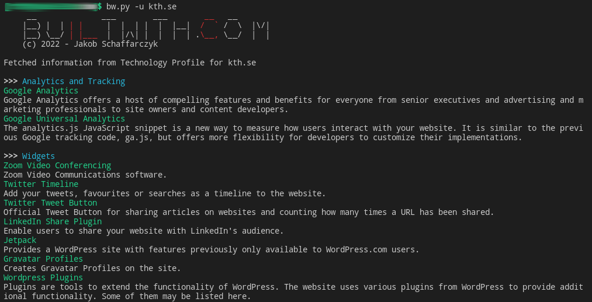

bw[]().py - CLI for builtwith[]().com
===
Command line tool to fetch the Technology Profile data from builtwith[]().com for any given domain or URL. Could sometimes fail due to captcha issues. Any other infos are atm not accessible due to the captchas as well, as they secure the login.

Maybe the Relationship Profile could be requested as well but it's not implemented at the moment due to, guess what... captcha issues.
### Installation
```sh
git clone https://github.com/js-on/bw
cd bw/
pip3 install -r requirements.txt
pip3 install .
```

### Usage
#### Fetch info
- Using Domain: `bw.py -u github.com`
- Using URL: `bw.py -u https://github.com/js-on/bw`

#### Choose output
- Stdout: `bw.py -u <url> [-o stdout]`
- JSON file: `bw.py -u <url> -o json`

#### Colorize already exported results
- `bw.py --colorize /path/to/bw_github.com.json`

### Example (shortened)
